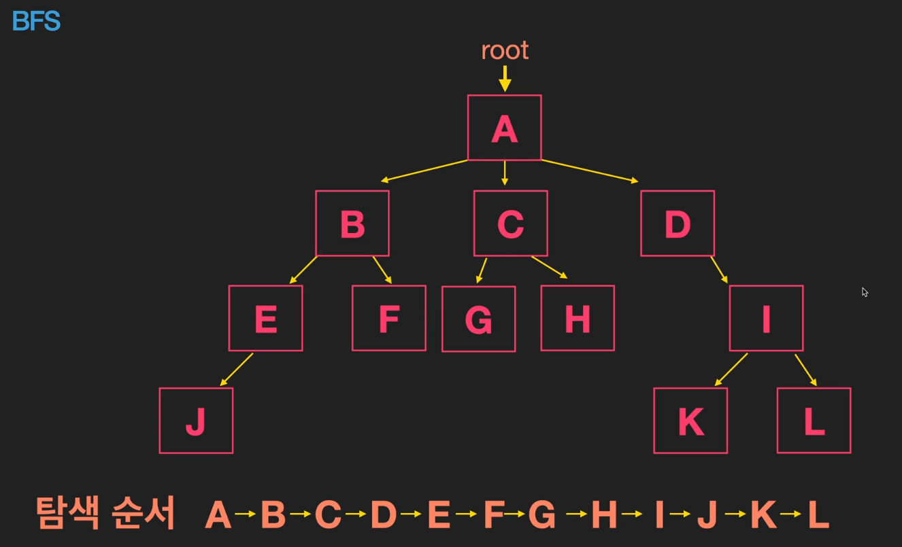

## 트리 순회
> 💡트리 탐색이라고도 불리우며 트리의 각 노드를 방문하는 과정을 말한다. 모든 노드를 한 번씩 방문 해야 하므로 완전 탐색이라고도 불린다. 순회 방법으로는 너비 우선 탐색의 BFS와 깊이 우선 탐색의 DFS가 있다.

### BFS 너비 우선 탐색

### DFS 깊이 우선 탐색

root만 알면 root가 가리키는 Tree에 속한 모든 노드를 접근.
재귀를 할 때는 무조건 base case가 있어야 한다.