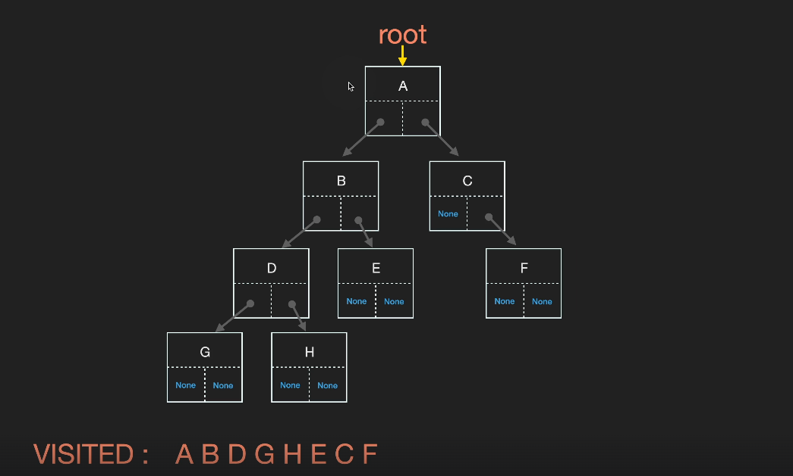
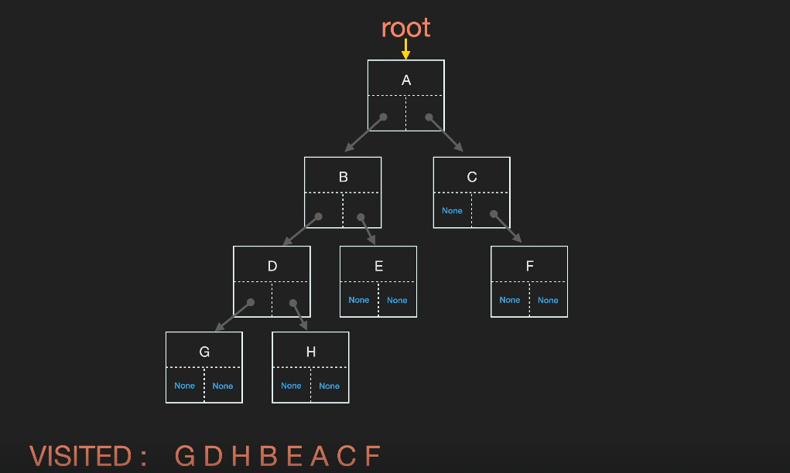
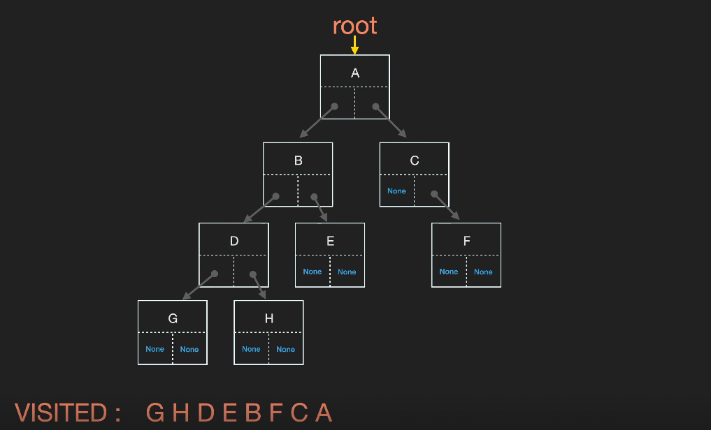

## 트리 순회
> 💡트리 탐색이라고도 불리우며 트리의 각 노드를 방문하는 과정을 말한다. 모든 노드를 한 번씩 방문 해야 하므로 완전 탐색이라고도 불린다. 순회 방법으로는 너비 우선 탐색의 BFS와 깊이 우선 탐색의 DFS가 있다.

### BFS 너비 우선 탐색


### DFS 깊이 우선 탐색

stack을 이용하거나 재귀함수를 사용해서 구현한다.   
root만 알면 root가 가리키는 Tree에 속한 모든 노드를 접근.
재귀를 할 때는 무조건 base case가 있어야 한다.

- 전위 순회
  
  - 자식노드 방문 전에 방문 먼저
```python
def preorder(cur_node):
    if cur_node is None:
        return
    print(cur_node.value)
    preorder(cur_node.left)
    preorder(cur_node.right)
```
- 중위 순회
  
  - 왼쪽 자식노드 모두 먼저 방문하고 자신 방문 후 오른쪽 자식노드 방문
```python
def inorder(cur_node):
    if cur_node is None:
        return
    inorder(cur_node.left)
    print(cur_node.value)
    inorder(cur_node.right)
```
- 후위 순회
  
  - 모든 자식 노드 방문 후 자신 방문
```python
def postorder(cur_node):
    if cur_node is None:
        return
    postorder(cur_node.left)
    postorder(cur_node.right)
    print(cur_node.value)
```
